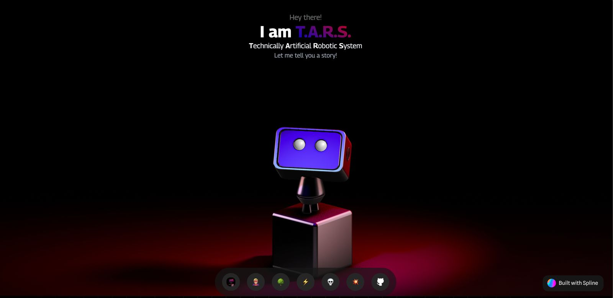

### Experience it yourself on 
&nbsp;&nbsp;&nbsp;&nbsp;

# THE LORE OF THE LEGEND

### I am TARS, Technically Artificial Robotic System. And I will take you on a journey to explore the lore of the legend.

#### Once upon a Time, there was a Developer... He had that D.A.W.G. in him.
#### Debugging . All . Weekend . Guaranteed . 
#### This is his story! The Story of Developer Avneet 🦸🏼‍♂️

#### His story starts in the Deadly forest of N.S.U.T.,where he seized a GPA of 8.71 from the woods.

#### In his quest through the forest, He discovered the ANCIENT POWERS OF THE GODS! ⚡️

#### And Used them to defeat many Deadly Villains

#### Fighting along side Armies who deemed him Worthy!
#### All hail the Champion!

#### TO MAKE HIS NAME ON THE HOLY TRINITY

# Tech Stack:

# On a serious note:
### I am a Full Stack Developer, who loves to code, and I am always looking for new challenges and this was my attempt to make a story driven portfolio, with a interactive timeline, where you can explore the story of the legend.

### For anyone who didnt completely get the context of it:
#### It is my story, TARS is the narrator, I am a student at NSUT. The ancient powers of the gods are my Skills, and the villains are the projects I have made. Army refers to the companies and experience I have gained throughout my journey. And the holy trinity is the Linkedin, Github and Leetcode.

### I am open to any suggestions, and I will be happy to hear from you.
